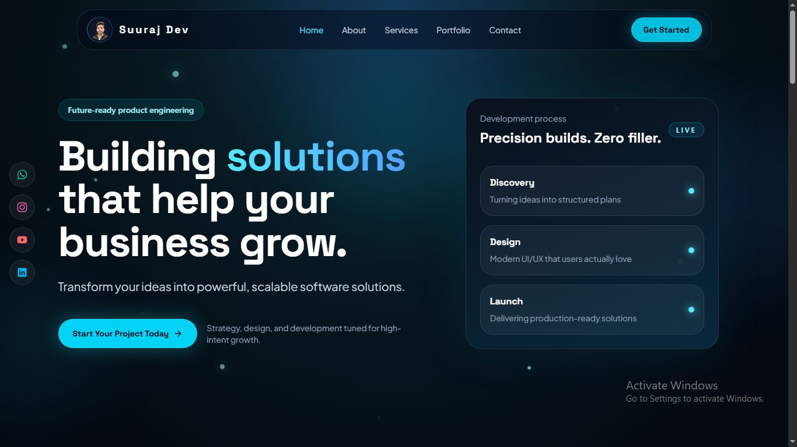

<h1 align="center">Suuraj Dev Portfolio</h1>



A modern dark-themed portfolio and agency-style landing page built with React, Vite, Tailwind CSS, and Framer Motion.

This project showcases a futuristic software services website with animated sections, responsive navigation, project highlights, contact cards, social links, and subtle star-field effects across the page.

<p align="center">
  🚀 Live Demo: https://surajchaurasia84.github.io/my-portfolio/
</p>

## Overview

This portfolio is designed for a software developer / agency presence. It focuses on:

- clean SaaS-style presentation
- responsive layout for mobile and desktop
- dark black + navy visual theme
- neon cyan accent styling
- smooth motion and scroll interactions
- reusable React components

## Tech Stack

- React 19
- Vite 8
- Tailwind CSS 4
- Framer Motion
- Lucide React

## Main Features

- Sticky/fixed responsive navbar
- Desktop navigation with active-section highlight
- Mobile menu with open/close animation
- Hero section with animated heading and CTA
- Left social sidebar with brand-colored icons
- Global subtle particles / twinkling stars background
- About section with metric cards
- Services section (`What We Offer`) with service cards
- Portfolio section (`Featured Projects`) with filter chips and project cards
- Contact section with stacked contact cards
- Footer with social icons and copyright info
- Scroll-to-top button on bottom-right

## Sections Included

### Navbar

- Logo image with soft animated border glow
- Links: Home, About, Services, Portfolio, Contact
- Active nav item changes color based on current section in view
- Mobile menu support

### Hero

- Full-screen landing section
- Main heading:
  `We only build what we are really really good at.`
- Highlighted word styling
- CTA button
- Floating particles and glow effects
- Social sidebar on large screens

### About

- Short brand positioning content
- Stats cards for business impact

### Services

- `What We Offer` heading
- 6 service cards
- Custom Software
- Web Development
- Mobile Apps
- UI/UX Design
- Backend Services
- QA & Testing

### Portfolio

- `Featured Projects` section
- Category filter chips
- Project cards with:
  - category badge
  - icon
  - title
  - short description
  - metrics

### Contact

- `Get In Touch` heading
- Contact cards for:
  - Email
  - Phone
  - Location

### Footer

- Social icons
- Copyright line with icon

## Design Notes

This project uses:

- dark radial and linear gradient backgrounds
- glassmorphism cards
- neon cyan accent glow
- soft shadows and blur layers
- animated particles and stars
- compact modern typography with `Space Grotesk` and `Plus Jakarta Sans`

## Responsive Behavior

- Desktop: full navbar, social sidebar, wide grid layouts
- Tablet: responsive card stacking and spacing adjustments
- Mobile: collapsible menu, stacked sections, touch-friendly spacing

## Accessibility Notes

- semantic links and buttons are used where relevant
- icon buttons include `aria-label`
- mobile menu button includes expanded state handling
- external links open safely with `rel="noreferrer"`

## Verification

This project has been verified with:

```bash
npm run lint
npm run build
```

## Author

**Suraj Chaurasia**  
Software Developer | India